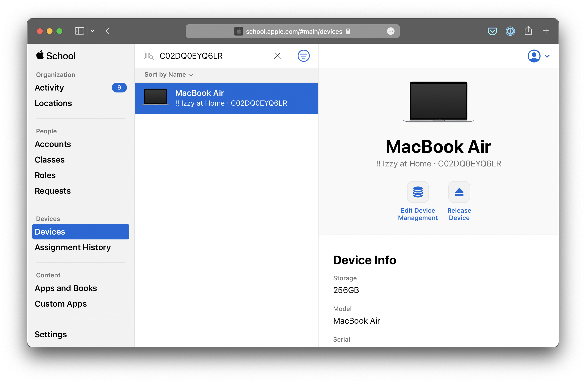
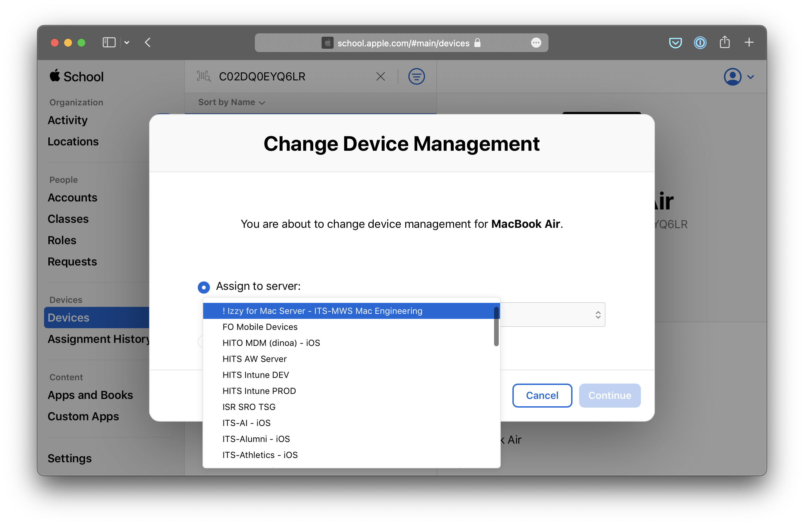

## Inside the
# Apple Device Enrollment
## build process

---

# Why

* “Out of box” deployment of a device, even remotely
* Enables management capabilities
* Helps in recovering a lost device[^1]
* Doesn't require making hardware-specific boot images

[^1]: Not really

---

# The major stages

1. Enrollment
1. Assignment
1. Remote Management
1. Bootstrapping MSC

---

# Enrollment

* Performed by the reseller: Tech Shop, CDW, or Apple directly
* Puts the device's serial number in our “pool”
* Typically the most annoying part

---

# Assignment

* Done by the Mac team
* Tells Apple which server to send the device to at setup
* Sorta-kinda like pre-setting a task sequence

---


---


---

# Remote Management

* At first boot, the Mac reaches out to Apple's match-making server
* If the match-maker knows about the device (enrolled & assigned), it returns a configuration blob with server details
* Can be triggered post-build with
`profiles renew -type enrollment`

---

# Management Payload

```
profiles show -type enrollment
...
    AwaitDeviceConfigured = 1;
    ConfigurationURL = "https://jss.euc.it.umich.edu/cloudenroll";
    IsMDMUnremovable = 1;
    IsMandatory = 1;
    IsMultiUser = 0;
    IsSupervised = 1;
    MDMProtocolVersion = 1;
    OrganizationAddress = "3003 S. State St, 7071 WOTO, , ANN ARBOR, MI 48109";
...
```
---

# Bootstrapping MSC

* Setup is configured to create the UM-Support account
* MDM installs its own tools (`jamf` and Service Provider Support) and a utility called `installapplications`
* installapps pulls down a JSON recipe of initial packages

---

# Bootstrapping MSC

* installapps installs and launches DEPNotify, which creates the progress screen you see
* installapps also installs Managed Software Center and the Izzy client
* Izzy does its initial registration steps using the logic board's UDID
* MSC is started and installs everything else
